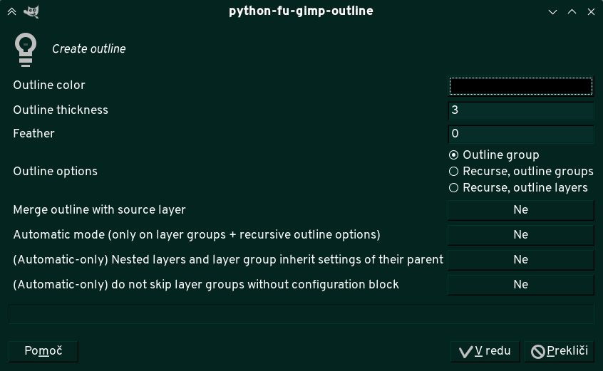

# Gimp outline

# TL;DR

1. Download `gimp-outliner.py`. The file goes to `~/.config/GIMP/2.10/plug-ins` on Linux or `C:\Users\your-name\Appdata\Roaming\GIMP\2.10\` on Windows.
2. The outline plugin should appear in `Filters > Decor > Create outline` the next time you start GIMP
3. There's a bunch of options you get (there are some bugged combos though). Mostly self-explanatory.

4. Except automatic mode. If you want automatic mode, you'll have to read the _"Auto-outlining based on layer name"_ part of this file.

# The life story

Outlining script for GIMP. Inspired by a similar plugin by Pete Nu ([link](http://pete.nu/software/gimp-outliner/)).

Back when I started writing that plugin, Pete's plugin had a few limitations that I found annoying:

* Since the plugin was written before layer groups were a thing, trying to outline a layer inside a group would produce broken results. (Fixed as of May 2020)
* No merging of the outline with source layer (Fixed as of May 2020)
* The script doesn't clean nicely after itself — selection remains active (Not sure of current status)

I also wanted some rudamentary automation features, because I had a side project where I created outlines a lot.

## Features

Not all of this works. I accept PRs.

* Make an outline of a single layer. You can define outline color, thickness and feather.
* Make an outline of every layer inside a layer group. Recursively, too.
* Make an outline of a layer group.
* Merge source layer with the outline (probably doesn't work if you're outlining a layer group)
* Auto-outlining based on layer (group) name
* It automatically clears selection when it's done

## Usage

### Installing 

Download `gimp-outliner.py` from this repository and put it in GIMP's plugin folder. You need GIMP 2.10.18 or later.

GIMP plugin folder:

* Linux: `~/.config/GIMP/2.10/plug-ins`
* Windows: `C:\Users\your-name\Appdata\Roaming\GIMP\2.10\`

### Using the script via UI

The scripts puts itself in `Filters > Decor > Create outline`. You will get a popup like this:

The first half is self explanatory:

* **Outline color:** this is the color of the outline.
* **Outline thickness:** outline will be this many pixels thick.
* **Feather** outline will be this fuzzy
* **Outline options:** determines how many outline layers you get:
  * _Outline group_ creates one outline for entire group.
  * _Recurse, outline group_ creates one outline for every group. Outline for group excludes outlines of subgroups. ***CURRENTLY BROKEN — CREATES ALL-BLACK LAYER***
  * _Recurse, outline layers_ outlines individual layers rather than groups. Groups are not outlined.
* **Merge outline with source layer:** By default source layer and outline are separate. This should merge them into one layer. ***THOROUGHLY UNTESTED, may not work when outlining groups***
* **Automatic mode:** create outlines based on layer name.
* **Nested layers inherit settings:** if layer or layer group doesn't have a valid name, it inherits settings from the parent layer.
* **Do not skip layer groups without config:** by default, automatic mode doesn't recurse through layer groups without config. Set to 'true' if that's inconvenient.

### Auto-outlining based on layer name

**Warning: for advanced users only.**

This feature is mildly useful if you're doing repetitive things, such as e.g. making a regular comic or something (especially if you're using multiple different outlines on different comic elements). If you're using a template file for your comic (with all layer groups pre-defined), you can put a "command block" into the layer name. When running extension in automatic mode, extension will do outlines according to what's in the command block.

You can put an outline block both on single layer as well as a layer group, but there's few caveats.

You can only use ***one*** command block for a single script. However, it should be safe to mix command blocks of multiple scripts.

If script runs recursively inside a layer group, any nested layer group will be processed with the same parameters as the parent group. (Some commands are exception to the rule)

If selected/top level layer group doesn't have a command block, it will be skipped. Any descendant layer or layer group that has a command block in its name, however, will be processed according to command parameters.

When outlining a layer group, new layer should appear under the group.

Example of a command block is here.

**Available commands**

* `()=>outline` — start of command block for auto-outlining script. Everything after this should be an argument. Arguments are separated by space.
* `skip` — don't process this layer / layer group. It doesn't stop recursion — the children will be processed normally. Doesn't apply to children.
* `()=>skip` — same as `skip`, except it also tells other scripts (that I wrote and have similar auto capabilites) to ignore this block. Doesn't apply to children.
* `end` — don't process this layer / layer group. Don't process children, either. Do I need to state the obvious?
* `()=>end` — makes other scripts of mine respect `end` command as well.
* `t=X` —  thickness in pixels (replace X with a number. There should be no spaces on either side of =)
* `f=X` —  feather (in pixels)
* `color=#xxxxxx` — outline color in hexadecimal/html values. Only takes the six-digit hex code, not words.
* `separate_groups` — will outline entire group instead instead of outlining each layer inside of the group individually. Outline of a layer group will not include outline of layers inside nested groups. Those will be processed separately. While using this option, command blocks on individual layers will be mostly ingored.
* `separate_layers` — will outline every layer inside a group (recursively)

If neither `separate_groups` and `separate_layers` are set, script will outline current layer or layer group. If outlining layer group in this case, the outline will contain outline of all layers in the layer group, including layers inside a nested group. In this case, the script will not recurse. These two options can _not_ be defined at the same time. If you try to use both at once, the last one wins.

* `merge_source` — merge source layer. Does nothing if `separate_layers` is not set.

Sometimes when using multiple levels of nested groups, you may want to use different rules for parents and children. All of these three are default values, meaning you normally don't need to specify them.

* `no_merge_source` — don't merge source.
* `no_separate_groups` — opposite of `separate_layers`
* `no_separate_layers` — opposite of `separate_layers`

**Before we go into the rest of commands, here's an important technical stuff about how the outline layer is named**

When creating a layer, the script will name the outline layer as `outline:: ` + original name (minus ***any*** command block) + ` ()=>skip`. E.g. say you want to make an outline of a layer named `Testy McTestyface ()=>outline t=1 color=#000000 ()=>some_other_command`. The outline layer for this layer  will be named `outline::  Testy McTestyface ()=>skip`. If the command block contains `merge-source` (e.g. `Testy McTestyface ()=>outline t=1 merge_source color=#000000`), the script will name the outline layer as `outline-ms:: ` + original name (minus original `()=>outline` command block) (e.g. `outline-ms::  Testy McTestyface ()=>skip`).

**NOTE:** NONE of the following commands apply to nested layers/layer groups.

* `preserve_cmd` — when creating the layer with outline, don't remove the original command block. If layer you're outlining has no command block, the script will NOT add the command to the name — e.g. outline of layer named `Testy McTestyface` will be `outline:: Testy McTestyface`
* `>>` — everything after `>>` is not considered to be part of command. Instead, it will be appended to the name of the outline layer. For example, outline of `Testy McTestyface >> ()=>outline t=3 color=#ffffff` will be named `outline:: Testy McTestyFace ()=>outline t=3  color=#ffffff`
* `no_default_skip` — when creating the layer with outline, don't automatically append `()=>skip` to the layer name. Cannot be defined at the same time as `>>` (`>>` has priority). Equivalent to `>> [no argument]` (probably, didn't test). 

***Usage examples***

* `()=>outline t=3 f=3 color=#000000` — make a black outline 3 pixels thick, feather it for 3 pixels.
* `()=>outline skip` — don't do anything

## Developing

Use `execfile("/path/to/python/script")` to load the script. If console crashes, comment out `main()` at the end of the file.
