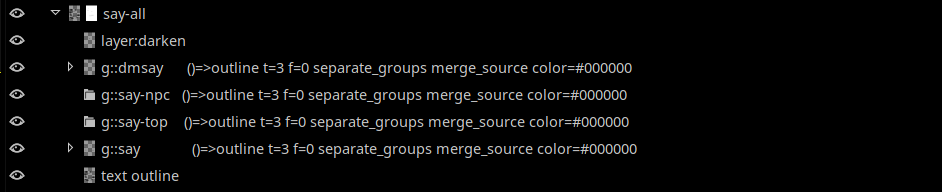

# gimp-outline

Outlining script for GIMP. This script is strongly inspired by a similar plugin by Pete Nu ([link](http://pete.nu/software/gimp-outliner/)). Unfortunately — while a great and useful tool that I've used extensively in the past — Pete's script has a few limitations:

* it's been written before layer groups were even a thing in GIMP. As such, its handling of layers inside a layer group is less than ideal: instead of outline appearing under the layer, the new layer is inserted at the top of the layer list, covering all other layers
* The script doesn't clean nicely after itself (selection remains active)

And especially the first one has slowly started to annoy me to the point I decided to write my own script. Because I'm writing the code this time around, I'm also in a position where I can insert any functionality I want. Without further ado:

## Features

* Make an outline of a single layer. You can define outline color, thickness and feather.
* Make an outline of every layer inside a layer group. Recursively, too.
* Make an outline of a layer group.
* Merge source layer with the outline (probably doesn't work if you're outlining a layer group)
* Auto-outlining based on layer (group) name
* It automatically clears selection when it's done
* (TODO) when using auto-outline, remove all previous outlines made by this script

### Auto-outlining based on layer name

**Warning: for advanced users only.**

This feature is mildly useful if you're doing repetitive things, such as e.g. making a regular comic or something (especially if you're using multiple different outlines on different comic elements). If you're using a template file for your comic (with all layer groups pre-defined), you can put a "command block" into the layer name. When running extension in automatic mode, extension will do outlines according to what's in the command block.

Example of a command block is here.

`::outline` — start of command block for auto-outlining script. Everything after this should be an argument. Arguments are separated by space.
`t=X` —  thickness in pixels (replace X with a number. There should be no spaces on either side of =)
`f=X` —  feather (in pixels)
`separate_groups` — will outline entire group instead instead of outlining each layer inside of the group individually. Not sure whether it includes nested layer groups. If it does, this may change so it doesn't.
`separate_layers` — will outline every layer inside a group (recursively)
`no_separate_groups` and `no_separate_layers` — those parameters are a testament why you don't write documentation two months after you've written the code. They're probably pointless.
`merge_source` — merge source layer (you probably can't merge an entire layer group though)
`no_merge_source` — don't merge source. This is the default behaviour, so you don't need to specify it. Useful if you have a layer group inside a layer group, and want to merge source for layers in the outer layer group, but want to keep the sources separated for the inner/nested layer group.
`color=#xxxxxx` — outline color in hexadecimal/html values. Only takes the six-digit hex code, not words.
`skip` — don't process this layer / layer group.

**Before we go into the rest of commands, here's an important technical stuff about how the outline layer is named**

When creating a layer, the script will name the outline layer as `outline:: ` + original name (minus original `::outline` command block) + ` ::outline skip`. E.g. say you want to make an outline of a layer named `Testy McTestyface ::outline t=1 color=#000000`. The outline layer for this layer  will be named `outline::  Testy McTestyface ::outline skip`. If the command block contains `merge-source` (e.g. `Testy McTestyface ::outline t=1 merge_source color=#000000`), the script will name the outline layer as `outline-ms:: ` + original name (minus original `::outline` command block) (e.g. `outline-ms::  Testy McTestyface ::outline skip`)

`preserve-cmd` — when creating the layer with outline, don't remove the original command block. If layer you're outlining has no command block, the script will NOT add the command to the name — e.g. outline of layer named `Testy McTestyface` will be `outline:: Testy McTestyface`
`>>` — everything after `>>` is not considered to be part of command. Instead, it will be appended to the name of the outline layer. For example, outline of `Testy McTestyface >> outline:: t=3 color=#ffffff` will be named `outline:: Testy McTestyFace outline:: t=3  color=#ffffff`